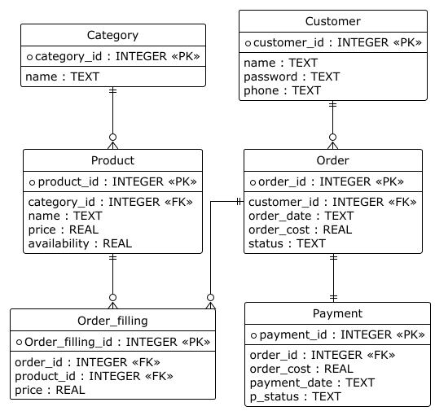

# Лабораторная работа №3

## 1. Предметная область
Система предназначена для учета заказов в интернет-магазине. В ней будут отслеживаться:
- Наличие товара
- Статусы заказов на всех этапах оформления

## 2. Цели системы:
- Оптимизировать процесс оформления и обработки заказов
- Автоматизировать учет товаров
- Обеспечить доставку заказов для покупателей

## 3. Пользователи системы и их роли

В системе выделяются следующие категории пользователей:

**Администратор**
- Управляет каталогом товаров

**Покупатель**
- Просматривает каталог товаров
- Оформляет заказы
- Отслеживает статус выполнения заказов

## 4. Основные функции системы

Для Администратора:
- Добавление и редактирование товаров в каталоге
- Обработка поступивших заказов
- Обновление статусов заказов
- Возврат денежных средств за потерянные заказы

Для Покупателя:
- Просмотр каталога товаров
- Оформление и подтверждение заказа
- Отслеживание статуса заказа 

## Диаграмма Use Case

## Блок-схема

## ER диаграмма

